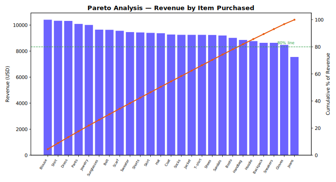

# Customer Shopping Behavior Analysis

Case study project analyzing a retail customer shopping behavior dataset — cleaning the raw
data, engineering a few analysis-friendly features, and building a set of interactive Plotly
charts and a KPI dashboard. Built as part of my analytics portfolio at
[gimeno.tech](https://www.gimeno.tech).

## Business problem

Retailers want to understand who their customers are, what drives revenue, and where there
may be opportunities (subscription conversion, shipping preferences, high-value segments).
This project turns a raw transaction-level export into a set of summary charts that answer
those questions at a glance.

## Approach

1. **Load** the raw shopping behavior CSV.
2. **Clean** the data: fill missing review ratings with the category median, normalize column
   names to `snake_case`, drop a redundant column, and derive two new features —
   `age_group` (quartile-based) and `purchase_frequency_days` (mapped from the purchase
   frequency label).
3. **Save** the cleaned dataset to `data/processed/` (git-ignored — regenerate it by running
   the notebook).
4. *(Optional)* Load the cleaned data into a local PostgreSQL database for further SQL-based
   analysis.
5. **Visualize**: build a set of dark-themed interactive Plotly charts (revenue by category,
   sales count by category, top 10 items by revenue, subscription share, revenue by age
   group, average purchase by shipping type, previous purchases vs. purchase amount) plus a
   combined KPI dashboard.
6. **Export** each chart as a standalone interactive HTML file for the portfolio site.

## Repo structure

```
customer-shopping-behavior-analysis/
├── data/incoming/                                    Raw source CSV
├── notebooks/                                         End-to-end analysis notebook
```

The interactive charts this notebook produces are published live on the portfolio site
rather than duplicated in this repo — running the notebook regenerates them locally as
standalone HTML files in a git-ignored `charts/` folder.

## Running it

```bash
pip install -r requirements.txt
jupyter notebook notebooks/CaseStudy_Customer_Shopping_Behavior_Analysis.ipynb
```

Running all cells top to bottom reproduces the cleaned dataset (`data/processed/`, git-ignored)
and every chart (`charts/`, git-ignored) from the raw data in `data/incoming/`. Paths are
resolved relative to the project root, so it runs the same whether you launch it from the repo
root or from inside `notebooks/`.

The optional PostgreSQL step reads its connection details from environment variables
(`PG_USER`, `PG_PASSWORD`, `PG_HOST`, `PG_PORT`, `PG_DATABASE`) rather than hardcoding them, so
no credentials are stored in the notebook. Skip that cell if you don't have a local Postgres
instance set up — it isn't required to produce any of the charts.

## Key findings

- A small number of product categories account for a disproportionate share of revenue.
- Subscribers and non-subscribers split unevenly, suggesting room for a subscription-conversion
  push among high-frequency non-subscribers.
- Shipping type correlates with average purchase amount, which may reflect basket-size-driven
  shipping choice rather than shipping type driving spend.
- Previous purchase count and purchase amount show only a weak relationship, with review rating
  scattered fairly evenly across both — high spenders aren't necessarily the most satisfied.

## Pareto analysis

Does a small share of items drive most of the revenue, the way the 80/20 rule would predict?
Items are ranked by total revenue and plotted against their cumulative share of revenue:



**This dataset does not follow the 80/20 rule at the item level.** Revenue is spread almost
evenly across the 25 items in the catalog — the top 20% of items (5 items) generate only ~22%
of revenue, and it takes 80% of the catalog (20 of 25 items) to reach 80% of revenue. The mild
skew noted above is a *category*-level pattern (Clothing ≈ 45% of revenue vs. an even 25%
baseline across 4 categories) — a plurality, not Pareto-level concentration. A "focus on the
top few SKUs" strategy isn't supported by this data; demand is broad-based, so category-level
(not SKU-level) prioritization is the more defensible lever.

## Notes

This is a from-scratch analytics/portfolio project — it is not a general-purpose retail
analytics library. Column names and category values are specific to this dataset's shape.
